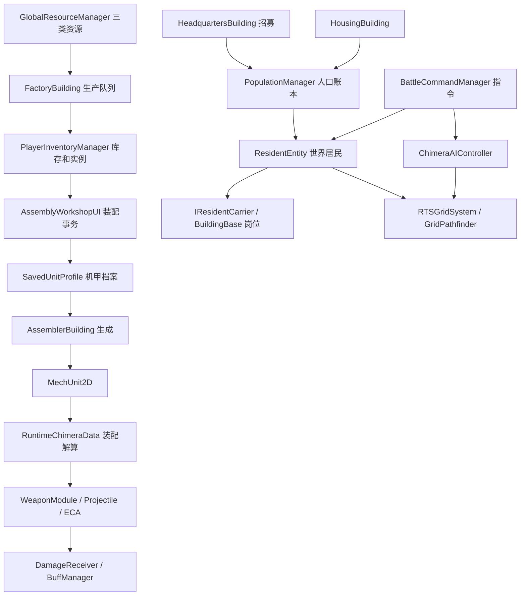

# Chimera 项目代码与架构学习记录

分析日期：2026-09-26。依据当前工作区代码、正式场景、Prefab、ScriptableObject 配置及现有文档。用于后续开发定位，不是完整功能验收报告。

本轮仅新增本文档，未修改游戏代码、场景或配置。开始分析时已有 UI 修整相关未提交修改；这些修改属于本次阅读基线。未发现项目内 `AGENTS.md`。

## 1. 当前项目定位

目标是“殖民地居民管理 + 资源管理 + 机甲塔防”。现阶段具备基地经营操作和较丰富的模块化战斗底层，但尚未形成资源采集、人员劳动、敌袭防御、胜负结算相互衔接的完整循环。

目前的两条主要流程：

- 总部招募居民 → 世界中的居民实体 → 右键入驻建筑 → 建筑保存居民数据 → 下岗重新生成实体。
- 三类资源 → 工厂任务队列 → 底盘/组件仓库 → 车间装配 → 世界机甲 → 移动、索敌、攻击 → 附近改装或回收。

工厂目前不依赖员工开工，也不使用居民熟练度计算效率。居民驾驶机甲、资源采集、敌袭波次、塔防目标与胜负条件均未接通。旧节点地图、爬塔、事件推进流程已经清除；目录中残留的“大巴扎”等名称不代表仍有完整对应玩法。

代码盘点：`Assets/Scripts` 下共 186 个 C# 文件、16,497 行，包含该目录下的编辑器脚本；其中直接继承 `ECAAction` 的实现有 60 个。盘点不是逐个动作完成运行验证。

## 2. 技术基线与场景配置

| 项目 | 当前值/实现 |
|---|---|
| Unity | 2022.3.62f3c1 |
| 表现与物理 | 2D、URP 14.0.12、Physics2D、UGUI、TextMesh Pro |
| 输入 | 现有代码使用 `UnityEngine.Input` |
| 正式启动链 | `Scene_MainMenu` → `RTS_World_Master`；也可直接运行基地场景 |
| Build Settings | 仅上述两个场景 |
| 编译组织 | 项目自有代码未见 `.asmdef`，通过目录及默认运行时/Editor 编译划分 |
| 场景预放建筑 | 总部、住房、工厂、装配建筑各一座 |
| 当前地图样例 | 100 × 12、CellSize=1、GridOrigin=(-12, -5.5)；宽高可独立配置 |
| 人口 | 基础上限 5，住房 Prefab 提供 2；人口列表初始为空 |
| 总部招募 | 脚本默认 20 秒，基地场景实际覆盖为 1 秒；不能直接用脚本默认值判断玩法 |
| 初始资源 | 废料、生物质、魔石均为 0 |
| 图纸资产盘点 | 全 Assets 有 4 个底盘、38 个组件、3 个配件、11 个敌人、12 个 Buff 配置 |
| 实际生产货架 | 场景的图纸库引用 4 个底盘、28 个组件；资产存在不等于已接入货架 |
| 建造图纸位置 | 3 份 `BuildingDataSO` 位于 `Assets/Scripts/建筑物Data`，不在 `Assets/Data` |
| 保存能力 | 无磁盘存档；`SavedUnitProfile` 是内存档案，`11_Save` 当前实际承担菜单/暂停/控制台 |

主要管理器随基地场景创建与卸载。音频、音乐及控制台存在 `DontDestroyOnLoad` 用法，不应据此推断人口、库存也会跨场景保留。

## 3. 主要依赖与代码入口

图中没有“员工 → 生产效率”和“居民 → 机甲驾驶”的连线，因为当前没有对应执行链。

以下目录均相对于 `Assets/Scripts`：

| 模块 | 目录与核心文件 | 职责 |
|---|---|---|
| 基础类型与公式 | `1_ Core (全局核心枢纽)`：`GameCoreTypes.cs`、`GameFormulas.cs` | 属性、资源、型号与技能结构；速度、攻速、护甲、动能公式 |
| 资源 | 同上：`GlobalResourceManager.cs` | 三类资源余额、支付、退款及变更事件 |
| 居民 | `居民系统`：`ResidentData.cs`、`ResidentEntity.cs`、`PopulationManager.cs` | 人口数据、招募落地、移动、入驻、死亡与放逐 |
| 建筑 | `建筑物`：`BuildingBase.cs`、`BuildingManager.cs`、各建筑子类 | 占地、注册、岗位、放置、招募、生产、机甲生成 |
| 空间 | `RTS/RTSGridSystem.cs`、`寻路优化/GridPathfinder.cs`、`建筑物/ConnectivityManager.cs` | 网格、A* 与路径简化、建筑入口连通性 |
| 库存及图纸 | `5_Economy_Bazaar (大巴扎经济驱动)` | 图纸 SO、堆叠库存、组件实例、机甲档案、配件契约 |
| 机甲实体 | `2_Entities (实体与行为底层)`：`MechUnit2D.cs`、`RuntimeChimeraData.cs` | 根据装配档案生成外观、解算属性和行为、接入战斗组件 |
| 战斗执行 | 同上：`WeaponModule.cs`、`Projectile.cs`、`DamageReceiver.cs`、`BuffManager.cs` | 武器状态机、弹道、伤害、状态效果 |
| 敌人 | 同上：`EnemyBrain.cs`；`4_ Combat_Director (战斗沙盘导演)` 中的敌人 SO、评分器与 `EnemyActionDirector.cs` | 意图状态机、技能评分、令牌配额 |
| ECA | `3_ECA_Engine (ECA 战斗行为树机制)` | SO 动作、上下文、条件闸门、伤害、物理、Buff、特效 |
| 指挥与 CP | `4_ Combat_Director (战斗沙盘导演)` | 单位登记、RTS 选择与指令、指挥点和主动技能 |
| UI | `新UI`、`8_UI_Frontend (前端交互表现层)`、`生产排队与进度条` | 选中看板、功能模块、装配、仓库、详情、拖拽排序 |
| 表现与工具 | `10_Effort`、`9_Editor_Tools (开发工具链与测试台)`、`Assets/Editor` | 音画反馈、HUD、对象池、配置工具、验证入口 |

整体以 MonoBehaviour 单例、静态注册表和 SO 数据驱动为主。UI 会直接修改库存、档案、任务队列，尚无统一独立的业务服务层。后续改动需同时检查脚本调用、Inspector 引用和 UnityEvent 绑定。

## 4. 关键数据与生命周期

### 居民与岗位

`ResidentData` 是人口账本中的持久内存对象，`ResidentEntity` 是世界表现。入驻成功后，建筑将同一个数据对象加入 `currentStaff`、状态设为 Working，居民实体销毁；人口总数不因此减少。下岗时重新生成实体并设为 Idle。居民死亡与放逐才从 `TotalResidents` 删除。

`IResidentCarrier` 定义载体名称、容量、员工列表、入驻/移除与交互点。目前只有 `BuildingBase` 实现它。`Piloting`、`CurrentCarrierID`、等级、特质、三系熟练度属于待接入数据；当前不能把它们视为已实现的职业或驾驶系统。

居民 HP 存于实体的 `DamageReceiver`，没有存入 `ResidentData`；下岗初始化使用默认满血。建筑内员工详情也显示占位满血。后续若做伤病、建筑毁坏或存档，需要确定居民状态的保存位置。

### 建造与空间

`ConstructionUIModule` → `BuildingManager.StartPlacement` → 幽灵建筑 → 网格吸附 → 占地与连通性检查 → `FinalizePlacement` / `OnPlaced`。

预放建筑由 `BuildingBase.Start` 注册；`RTSGridSystem` 使用执行顺序 -100，先初始化网格。销毁建筑释放占地，住房额外刷新人口上限。

连通性采用从四侧边界同时扩散的四方向 BFS，要求新旧建筑至少有一个入口可达边界。它只解决建筑通路，不能当作敌人出生点到总部的塔防路线校验。实际居民交互仍优先使用第一个入口，装配产出另有选门逻辑。

`BuildingDataSO.BuildTime` 与 `GoldCost` 明确是预留项，当前放置流程没有资源扣费和施工阶段。

### 生产与库存

工厂入队先通过 `TryConsume` 扣款，`ProductionTask` 记录实际支付成本。每次处理队列中第一个未暂停任务；取消任务全额退款，完成后产物入库。当前 UI 生产组件固定请求 Mk.1，生产速度直接使用 `Time.deltaTime`。

库存存在两种不同表示：

- 未装配库存：底盘按 ChassisID 堆叠，组件按 ComponentBaseID + 型号堆叠。
- 已进入装配的数据：`InstancedComponent` / `InstancedChassis` 使用唯一 InstanceID；`SavedUnitProfile` 通过平行列表 `SlotIndices` / `EquippedComponentIDs` 保存挂载关系。

`ComponentInventory` 虽注释为临时缓存，但世界机甲初始化和详情页仍通过它解析实例 ID，实际上承担运行中实例索引职责，不能随意清空。

`ComponentFabricator` 是另一套资源校验永远通过、生产时间为零的占位入口，不应误用为当前正式工厂生产管线。

### 装配与世界机甲

`AssemblyWorkshopUI` 负责选择底盘、槽位过滤、出入库、属性预览、保存与取消回滚。改装时保存槽位、组件 ID、HP/AP 快照，但编辑的是世界机甲当前档案对象。

合法配置要求恰好一个 Core、至少一个 Movement；当前不强制有 Weapon。保存时把 HP/AP 设为预览上限，因此车间同时承担维修作用。新建通过 `AssemblerBuilding.SpawnMech` 生成；改装通过 `MechUnit2D.ReAssemble` 重建。

`RuntimeChimeraData.Assemble` 根据底盘、组件型号和配件聚合属性，并产生每个组件的逻辑代理与动作链。武器局部属性使用 StatType 10–19 的数值区间识别；改变枚举数值会影响序列化与解算。

`MechUnit2D` 根据底盘槽位动态搭建 Sprite、碰撞体、WeaponModule，并初始化 DamageReceiver、ChimeraAIController 和 MechSkillController。回收会将底盘和组件返回堆叠库存后销毁实体。

### 战斗与 ECA

ECA 的实际结构是“事件触发 + 按 Priority 执行的 SO 动作链 + 共享上下文”，没有看到通用行为树节点调度器。动作通过 `ECAContext` 读取施法者、目标、武器、伤害和状态字典，可中止执行或接管默认投递。

常规攻击链：武器定期索敌 → 计算基础伤害 → 局部/全局 OnFire → 近战直接命中或远程 Projectile → RuntimeWeapon.OnHit → 伤害动作 → DamageReceiver。普通伤害先减固定 Block，再消耗 AP，剩余扣 HP；真实伤害绕过前两者。Buff 修正公式为 `(基础值 + 加法之和) × (1 + 百分比之和)`。

机甲 OnTick 由 `MechUnit2D.Update` 遍历组件代理执行。SO 是共享配置，运行状态应区分每个单位、每个组件实例；现有代码使用 `PersistentStates`、武器 `CustomStates` 和上下文字典，新增机制时需明确状态作用域。

普通敌人使用 `EnemyBrain` 的 Thinking / Positioning / Channelling / Executing / Dead 状态机；技能评分器决定意图，`EnemyActionDirector` 用令牌限制同类动作并发。模块化精英另有 `MechUnit2D.InitAsEliteEnemy` 入口，不能默认两类敌人的初始化链完全相同。

`CombatDirector` 当前主要承担双方 DamageReceiver 注册表、独立战斗开关和退出清理，没有波次调度或胜负判定。

## 5. 已存在与未接入能力

| 方向 | 已存在 | 尚未形成完整玩法 |
|---|---|---|
| 居民 | 自动招募、人口上限、移动、派驻、下岗、遣散、放逐、实体死亡 | 职业成长、特质效果、劳动效率、机甲驾驶、需求/日程 |
| 资源 | 三类余额、消费、退款、HUD、生产成本 | 采集来源、资源枯竭/再生、物流、持续经营消耗 |
| 建筑 | 图纸选择、放置、占地、入口检查、四类基础建筑 | 施工与造价、升级、拆除、完整受损/员工处置规则 |
| 机甲 | 底盘槽位、组件型号、装配预览、配置校验、生成、改装与回收 | 驾驶员约束、实例资产完整生命周期、持久化 |
| 战斗 | 武器、弹道、ECA、Buff、敌人意图、CP、技能底层 | 正式敌袭、进攻目标、路线规则、胜负及战后经济 |
| UI | 选中看板、仓库、车间、任务排序/暂停、Esc 分层返回、屏幕提示 | 若干明确显示“尚未实现”的入口；主动技能栏缺少正式构建调用 |

机甲看板的“回收”已有执行逻辑，而机甲详情页的“拆解”仍是提示占位，两者不能混为一谈。

## 6. 后续开发前应关注的静态发现

以下根据当前调用链得出，未在本轮执行 Play Mode 复现，也未修复。它们用于缩小后续检查范围，不代表所有配置都会触发问题。

| 观察 | 代码依据与影响 |
|---|---|
| 同图纸多实例被合并索引 | `RuntimeChimeraData.ComponentToRuntimeMap` 以 ComponentDataSO 为键，后一个同型组件覆盖前一个代理。EquippedWeapons 仍保留多个武器，但 OnTick 遍历和局部查找可能只覆盖部分实例。计时器也需核对同一 SO 在单机多插槽的共享状态。 |
| 全局命中效果未接入常规命中链 | `GlobalOnHitActions` 有收集、清空与排序，没有找到执行读取；`TriggerHitPipeline` 只遍历武器自身 OnHitActions。非武器组件声明的全局命中效果不能仅凭配置认为有效。 |
| 开战协议与主动技能 UI 缺少正式衔接 | `AssemblerBuilding.SpawnMech` 未调用 `ExecuteBattleStartProtocol`；当前找到的调用在 RTSTestBench。`BuildSkillUI` 未找到代码调用或场景/Prefab 同名 UnityEvent 绑定。应先确定“生成时”与“波次开始时”的触发语义。 |
| 战斗开关不是所有系统的统一暂停 | MechUnit2D 的 Tick、EnemyBrain 和 CP 检查 IsCombatActive，WeaponModule 与 ChimeraAIController 的常规更新不统一检查。全局暂停当前依靠 Time.timeScale；未来准备/战斗阶段切换需明确契约。 |
| 路径规则与建造规则不同 | 建造使用四方向并检查 IsWalkable；GridPathfinder 使用八方向、主要只检查 IsOccupied，没有统一检查 IsWalkable 或斜向夹角。自动追敌直接设置朝向目标的速度，也不走同一套 A*。加入地形障碍和塔防路线前需统一。 |
| 居民入驻状态尚未闭合 | CurrentCarrierID 没有写入链，普通 SetDestination 不清除 targetCarrier；载体销毁与员工去向也没有完整处理。多入口通行检查与居民使用首个入口之间存在差异。 |
| 库存与实例生命周期需补齐 | 卸载、取消、回收主要恢复堆叠数量，ComponentInventory 没有相应完整回收；芯片附着在实例 ID 上，而堆叠不保存这些个体属性。加入独特配件/耐久/存档前需定义转换规则。 |
| HP/AP 有两份状态 | 战斗修改 DamageReceiver，SavedUnitProfile 保留自身 HP/AP；未找到通用实时回写链。车间快照基于 Profile，保存会维修至满。后续持久化和取消事务不能把 Profile 数值直接当作实时受损值。 |
| 改装初始化可能重复订阅死亡事件 | 每次 ReAssemble 都进入 ActivateCombatBrainsSafe 并追加 OnEntityDeath 回调，未看到配套移除旧回调。应纳入连续改装后的生命周期验证。 |

还需区分注释和实际实现：例如 `GameFormulas.CalcMoveSpeed` 注释提及 3.0 保底，实际 `baseSpeed` 为 1.0。新功能应以执行代码与场景序列化配置为准。

## 7. 后续工作的定位建议

这些是接入位置建议，不代表已经确定玩法规则或本轮要实施：

1. 居民影响经营：从 IResidentCarrier、BuildingBase.currentStaff、FactoryBuilding.UpdateProduction 入手，明确人数、熟练度与产速的关系。
2. 资源采集：复用 ResourceSet / GlobalResourceManager，先定义来源、占地与人员要求，再加入生产循环。当前 ScrapDensity 只是网格字段。
3. 机甲驾驶：扩展载体与派驻指令，定义驾驶员数据、上下机、机甲战损和居民死亡关系；当前右键派驻只探测建筑层。
4. 敌袭塔防：新增明确的波次/目标流程，复用敌人图纸和战斗底层；先确定进攻目标及路径契约，不把边界连通性直接当成塔防规则。
5. 存档：先统一居民、建筑、库存、组件实例、世界机甲和生产任务的所有权，再设计稳定 ID、SO 映射与磁盘序列化。
6. 新组件机制：先复用现有 ECA 动作和 ModelRegistry 配置；涉及重复组件、开战、全局命中或状态字典时，先验证上表中的对应调用链。

常用阅读顺序：GameCoreTypes → PopulationManager / BuildingBase → FactoryBuilding / PlayerInventoryManager → AssemblyWorkshopUI → RuntimeChimeraData / MechUnit2D → WeaponModule / ECA_Core / DamageReceiver → BattleCommandManager / SelectionContextHUD。

## 8. 本轮验证与后续复验入口

本轮实际执行 `python Tools/validate_assets.py`：退出码 0；扫描 564 个文本资源/脚本，解析 11,595 个 GUID，正式项目错误列表为空。当前没有待删除资源，因此 deleted_guids_checked 为 0。TextMesh Pro 第三方示例仍报告 39 条引用问题，与正式场景分开统计。

本轮没有启动 Unity、重新编译、运行 Play Mode 或构建 Player。静态引用检查通过不代表战斗、装配事务及画面已完整验收。

已有 Unity 验证入口为 `Assets/Editor/ProjectCleanupValidation.cs` 的 `ProjectCleanupValidation.Run`，包含资源引用、菜单进出基地、建筑注册、招募、暂停、网格形状、相机、测试敌人和部分 UI 交互检查。按现有项目文档，应在只复制 Assets / Packages / ProjectSettings 的隔离项目中执行，不修改原项目缓存；异步验证器自行退出，命令不加 `-quit`。旧验证结果属于历史记录，不是本轮重跑结果。

调试操作：WASD/方向键与中键移动相机；右键下达移动/攻击/派驻或设置集合点；Esc 分层返回或暂停；R 注入 500 废料、200 生物质、50 魔石；E 在鼠标处生成测试敌人。T/Y 发放调试底盘/组件仅在 UNITY_EDITOR 分支内，R/E 当前没有同样的编译限制。

相关历史文档：`README.md`、`Docs/LegacyCleanupReport.md`、`Docs/UIUsabilityFixes.md`、`Docs/ArchivedCombatConfigurations.md`。本文是分析时点快照，后续实现改变数据契约时应同步更新。
